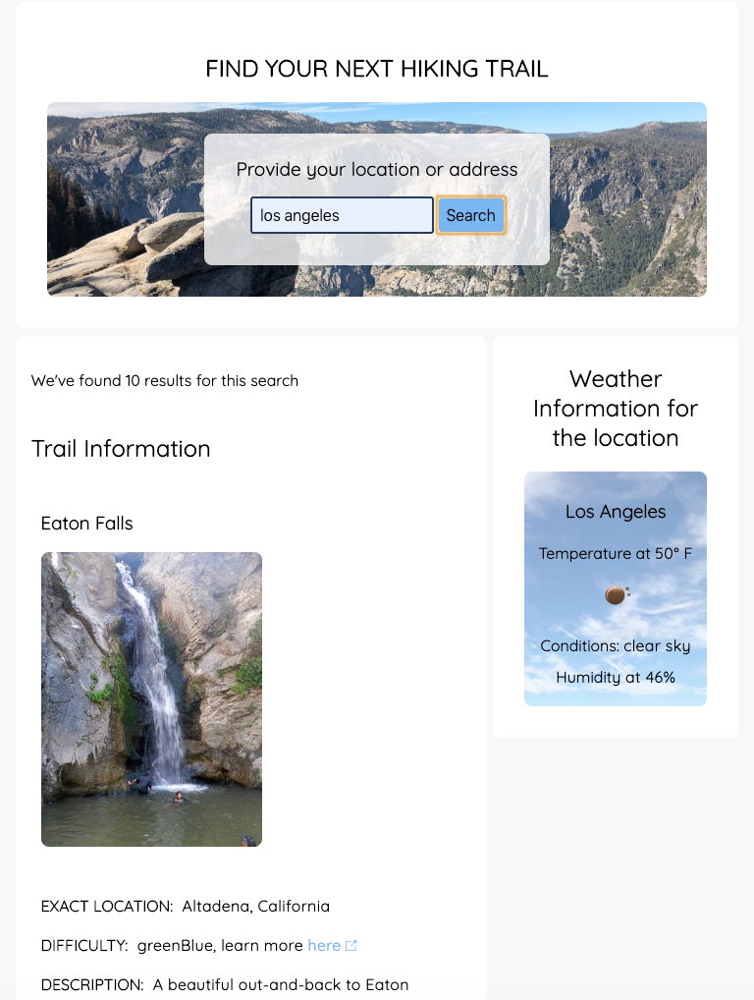
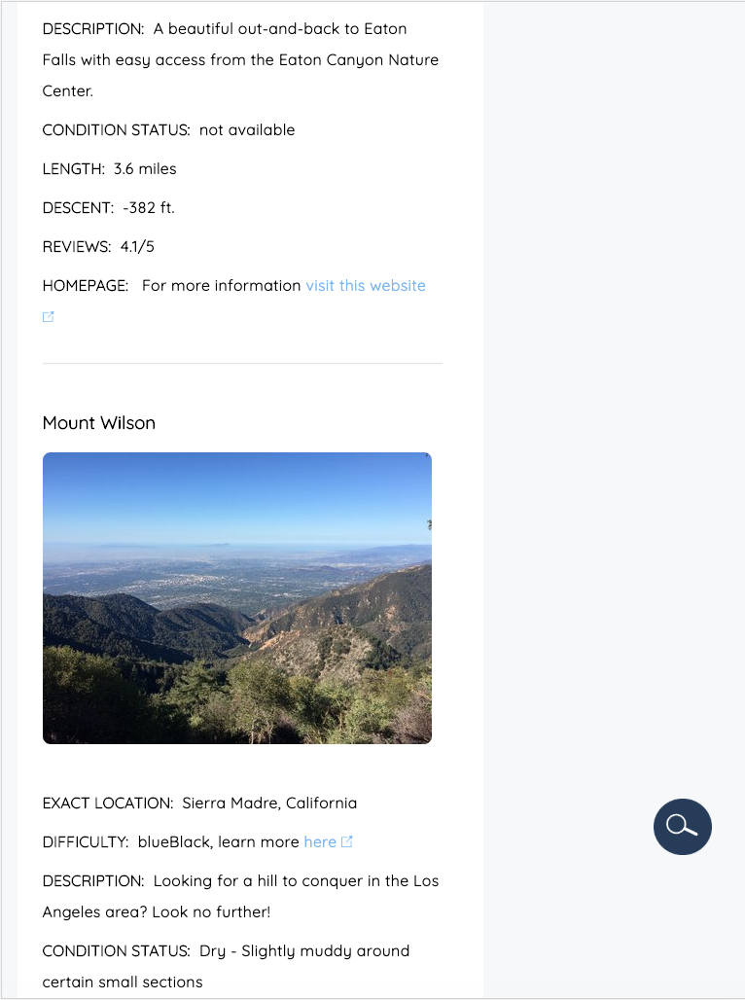

# Trail Finder
# Description: 
This is my first Capstone project for Thinkful. 
Web Application allows to find hiking trails within 15miles of your location as well as chceck the current weather conditions for that locationa.The application uses openweather API to fetch the weather condtiond for the specified location as well as hiking project API to allow user to find hiking trails.
# Functionality:
The app is designed so that the user can provide a specified loction and in return he/she will be able to access 
information on the nearby trails such as: description, user's recommendation, weather, length, current conditions, difficulty level of the trail 
# Responsive:
The app has been designed to work on mobile, tablet and desktop screens.
# Technologies: 
JQuery, API, JS 
# Live version: 
https://kitsunechin.github.io/Trail_Finder/ 
# API documentation:
https://api.opencagedata.com \
https://www.hikingproject.com \
https://api.openweathermap.org 
# Screenshots:
\

